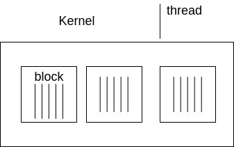
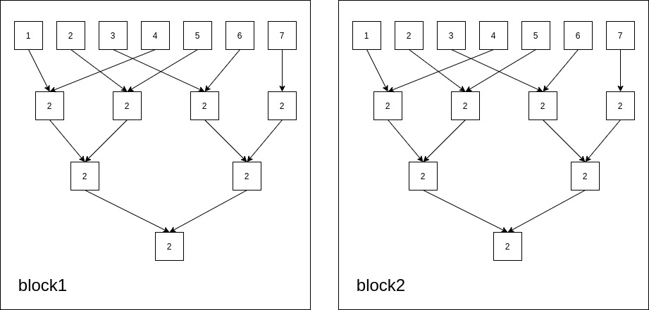
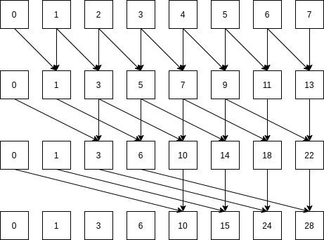

# CUDA的学习笔记

## 基础知识

### CUDA软件体系

1. CUDA Library
2. Runtim API
3. Drive API

### 通讯模式 Communication Patterns

1. 映射 map:一一对应（one to one） 例如：```y[i] = 3 * x[i]```

2. 聚合 gather:多对一（many to one）例如：```y[i] = (x[i-1]+x[i]+x[i+1])/3```

3. 分散 scatter：少对多（one to many）与gather相反

4. 模板 stencil 以固定模式读取相邻的内存数值（serveral-to-one）

5. 转置 transpose

6. 压缩 reduce

7. 重排 scan/sort

### CUDA编程模型


1. CPU分配空间给GPU```cudaMalloc()```

2. CPU复制数据给GPU```cudaMemcpy()```

3. CPU加载Kernels函数给GPU计算
4. CPU复制GPU数据

### CUDA编程特点

1. **最大特点**：线程块将在何时何处运行不作保证
**原则**： 同一个block的线程会在同一时间运行在同一个SM中，同一个内核的所有线程块全部完成之后才会运行下一个内核。
2. **内存速度**：**local memory > share memory >> global memory > host  memory**
3. **同步操作**：
   1. 线程同步```__syncthreads()```，屏障```__barrier_sync()```，当所有线程到达屏障时才继续进行

   2. ```__threadfence()```通知整个grid当前thread的进度

   3. 在HOST端可以使用```cudaThreadSynchronize()```, 同步host端和device端

### GPU硬件特点



**SM**即流处理器：把Kernel分配的线程块放到SM中运行

### 高效策略

**计算强度  =  $\frac{Math}{Memory(每个线程的内存)}$**

常用的方式

1. Kernel读取的数据量最小
2. 让每个线程读取的速度更快
   1. 使用local memory > share memory > global memory
   2. 合并全局内存（线程按顺序读取内存）

3. 避免线程发散
   1. 不要在不同线程执行不同的代码块
   2. 循环长度不同

4. 查看本机参数，kernel加载时不要超过本机参数

### 各种内存的使用方式

1.局部内存，local memory, 在kernel函数中创建的局部变量（每个线程都有自己的局部变量内存空间）
2.全局内存, global memory, GPU kernel函数接收CPU数据的内存空间，所有的线程块使用同一个全局内存
3.共享内存， shared memory, 一个线程块里的所有线程同用一个共享内存

### 原子操作

可以使多线程读写同一内存队列

1. 目前只支持简单的整形运算```atomicAdd()```

2. 读取顺序不确定
3. 肯能会拖慢系统时间

## 程序设计

### 归约reduction

目前可以理解为，可以需要并行计算的数据使用同样的算法进行多次计算，以求得结果。

最常见的例子是并行求和算法，以下图为例子



由图可知其**算法步骤**大致可以分为：

1. 将输入的待加的数据对半分开取整，然后按照设计步长依次相加，没有对应相加的数据直接落下来，在第二次运算时相加，直到只有最后一个数据，便是这个线程块数据的总和

2. 然后在把所有线程块里最后的一个数据重复步骤1的操作，即可得到所有数据的总和

```c++
//步骤1代码 （使用以共享内存计算为例子）
__global__ void shared_reduce(float * d_out, float * d_in){       
   //每一个线程快共享一个 shared memory
    extern __shared__ float sdata[];
    int threadid = threadIdx.x;
    int kernelid = threadIdx.x + blockDim.x * blockIdx.x;

    sdata[threadid] = d_in[kernelid];

    __syncthreads();

    for(unsigned int s = blockDim.x / 2; s > 0 ; s >>= 1 ){
        if(threadid < s){
            sdata[threadid] += sdata[threadid + s];
        }
        __syncthreads();
    }
    if(threadid == 0){
        d_out[blockIdx.x] = sdata[threadid];
    }
}
```

### 扫描scan

&emsp;&emsp;例如计算一家餐厅的一周以来的**前某天**的收入总和。以下图为例子。

&emsp;&emsp;&emsp;&emsp;&emsp;&emsp;

1. 先让里面所有数据间隔为$2^0$的数据两两相加
2. 再让里面数据间隔为$2^1$的数据两两相加，一直执行n次，截至条件为$2^n \geq s$,s为数据总量

```c++
__global__ void global_scan(float * d_out, float * d_in, int size){
    int kernelid = threadIdx.x + blockDim.x * blockIdx.x;
    // int threadid = threadIdx.x;
    int local_size = size;      //减少对全局变量的读取次数
    float out = 0.00f;
    d_out[kernelid] = d_in[kernelid];
    __syncthreads();
    for(int interval  = 1; interval < local_size; interval <<= 1 ){
        if(kernelid - interval >= 0){
            out = d_out[kernelid] + d_out[kernelid - interval];
        }
        __syncthreads();
        if(kernelid >= interval){
            d_out[kernelid] = out;
            out = 0.00f;
        }
    }
}
```

**目前该[程序](./scan/scan.cu)存在问题**：当输入的d_in的size太大时会出现计算错误

### 并行直方图

以128个数字做直方图为例子，采用**局部直方图**的方法进行设计

1. 先把128分成8个线程，每一个线程处理16个数据，在其内部建立一个串行直方图，以3组为例（按照除以三的余数分类）。
2. 然后使用归约算法（reduction）将这个8个线程内的数据加起来，即可得到并行设计的直方图

```c++
__global__ void local_histogram(int * d_out, int * d_in, int size_thread, int interval){
    
    int threadid = threadIdx.x;
    int remainder_3 ;

    for(int i = 0; i<size_thread; i++){
        remainder_3 = d_in[size_thread*threadid + i] % interval ;
        d_out[threadid * interval + remainder_3] += 1;
    }

}

__global__ void local_histogram_reduce(int * d_out, int * d_in, int interval){
    
    extern __shared__ float sdata[];
    int threadid = threadIdx.x;
    int kernelid = threadIdx.x + blockDim.x * blockIdx.x;

    sdata[threadid] = d_in[kernelid];

    __syncthreads();

    for(unsigned int s = blockDim.x / 2 ; s >= interval ; s >>= 1 ){
        if(threadid < s){
            sdata[threadid] += sdata[threadid + s];
        }
        __syncthreads();
    }
    if(threadid < 3){
        d_out[threadid] = sdata[threadid];
    }
}
```

目前程序为举例的程序，不能实现任意数据的直方图的转换，后面还需要改进。

### 压缩与分配

压缩（compact）:概括的说，就是判断输入数据时候符合该程序要求，对真值输入分配1，对假值输入分配0。其步骤大致如下：

1. 通过一个并行的判断，把需要的进行分析的线程通过一个判断全部筛选出来。
2. 把筛选出来的线程作并行分析。

分配（allocate）：输出项可以动态的从每一个输入项计算得出，目前可以理解为，把输入组拆开成独立的输入，然后进行分析计算。

### 分段扫描

以稀疏矩阵乘法为例：
$$
\begin{bmatrix}
a & 0 & b \\
c & d & e \\
0 & 0 & f
\end{bmatrix}
\begin{bmatrix}
x \\ y \\ z  
\end{bmatrix}
$$

&emsp;&emsp;可以看出的稀疏矩阵存在许多的0，然而我们对于0的计算没有意义，所以我们把需要把矩阵中的0给剔除。所以我们可以用另外一种方式来表述该稀疏矩阵：

**value** &emsp;&emsp;$\begin{bmatrix}
    a & b & c & d & e & f  
\end{bmatrix}$

**column** &emsp;$\begin{bmatrix}
    0 & 2 & 0 & 1 & 2 & 2  
\end{bmatrix}$

&emsp;&emsp;&emsp;&emsp;&emsp;

### 流Stream

NVIDIA的GPU如下特点：

1. 数据拷贝和数值计算可以同时进行。
2. 两个方向的拷贝可以同时进行（GPU到CPU，和CPU到GPU），数据如同行驶在双向快车道。
3. 进行数值计算的kernel不能读写正在被拷贝的数据。

Stream是实现以上两个并行的重要工具。基本的概念是：

1. 将数据拆分称许多块，每一块交给一个Stream来处理。
2. 每一个Stream包含了三个步骤：
   1. 将属于该Stream的数据从CPU内存转移到GPU内存
   2. GPU进行运算并将结果保存在GPU内存
   3. 将该Stream的结果从GPU内存拷贝到CPU内存。
3. 所有的Stream被同时启动，由GPU的scheduler决定如何并行。

&emsp;&emsp;假设我们把数据分成A，B两块，各由一个Stream来处理。A的数值计算可以和B的数据传输同时进行，而A与B的数据传输也可以同时进行。由于第一个Stream只用到了数据A，而第二个Stream只用到了数据B，“进行数值计算的kernel不能读写正在被拷贝的数据”这一限制并没有被违反。

### 多GPU编程(粗略还需继续深入学习)

#### 基础

1. 多GPU两种连接方式:
   1. 多GPU通过单个节点连接到PCIe总线上
   2. 多GPU连接到集群中的网络交换机上
2. 两种常见的GPU通信模式
   1. 没必要进行数据交换,GPU间没有数据共享
   2. 有部分数据交换,GPU需要冗余数据存储。要避免通过主机内存中转数据(从GPU复制到Ram,再复制到另一个GPU上)
   ```cudaError_t cudaGetDeviceCount(int*count);```获得的GPU数量
   ```cudaError_t cudaSetDevice(int id);```指定使用哪个GPU.从0到n-1,默认设置为0.可以使用循环向多个GPU发送指令,异步不会阻塞
   ```cudaError_t cudaGetDeviceProperties(struct cudaDeviceProp*prop,int device);```获得GPU属性

#### 点对点通信

1. 点对点访问:在CUDA内核和GPU间直接加载和存储地址
2. 点对点传输:在GPU间直接复制数据
3. 两个GPU连接到不同的PCIe根节点上,不允许直接进行点对点访问.
4. ```cudaError_t cudaDeviceCanAccessPeer(int* canAccessPeer, int device, int peerDevice);```支持P2P返回1,否则返回0
5. ```cudaError_t cudaDeviceEnablePeerAccess(int peerDevice,unsigned int flag);```显式启用点对点内存访问,一旦启用成功,立刻能访问对等设备,这个授权是单向的,不允许对方访问
6. ```cudaError_t cudaDeviceDisablePeerAccess(int peerDevice);```关闭P2P

#### 点对点内存复制

```cudaError_t cudaMemcpyPeerAsync(void*dst, int dstDev,void* src,int srcDev,size_t nBytes, cudaStream_t stream);```启动P2P后,异步复制设备上的数据,从srcDev传输到dstDev内存中.如果srcDev和dstDev共享相同的PCIe根节点,则数据通过PCIe最短路径传输

#### 统一寻址的点对点访问

UVA将CPU系统内存和设备的全局内存映射到单一的虚拟地址空间中.所有cudaHostAlloc分配的主机内存和cudaMalloc分配的设备内存主流在统一的地址空间内.

#### 跨GPU集群拓展应用程序

1. MPI(消息传递接口)标准化的数据通信API,通过分布式进程之间的消息进行数据通信
2. GPU之间不同节点上移动数据的MPI有两种实现方式:
    1. 传统的MPI :GPU内存要先复制到主机内存,再传输
    2. CUDA-aware MPI:吧GPU内存直接传输,对InfiniBand集群,MVAPICH2是被广泛使用的开源MPI库
3. MPI程序包括4个步骤
   1. 初始化MPI环境
   2. 使用阻塞或非阻塞MPI函数在不同节点间的进程传递消息
   3. 跨节点同步
   4. 清理MPI环境

### 纹理内存(粗略还需继续深入学习)

#### 纹理内存的特性

&emsp;&emsp;纹理存储器中的数据以一维、二维或者三维数组的形式存储在显存中，可以通过缓存加速访问，并且可以声明大小比常数存储器要大的多。在kernel中访问纹理存储器的操作称为**纹理拾取**(texture fetching)。将显存中的数据与纹理参照系关联的操作，称为将数据与**纹理绑定**(texture binding).显存中可以绑定到纹理的数据有两种，分别是普通的线性存储器和cuda数组。
&emsp;&emsp;线性存储器是用cudaMalloc()声明的一段连续的线性内存空间，而CUDA数组则是通过cudaMallocArray()进行声明，并且是线性对齐的。CUDA数组对于纹理拾取访问进行了优化，但是设备端只能通过纹理拾取访问， 即我们不能直接操作CUDA数组。可以说，CUDA数组就是为纹理拾取而生的。
**注**：

* 线性存储器只能与一维或二维纹理绑定,采用整型纹理拾取坐标，坐标值与数据在存储器中的位置相同；
* CUDA数组可以与一维、二维、三维纹理绑定，纹理拾取坐标为归一化或者非归一化的浮点型，并且支持许多特殊功能。

#### 纹理内存作用

1. 纹理内存中的数据可以被重复利用，当需要的数据存在于纹理缓存中，就不用再去显存读取了
2. 纹理拾取可以读取纹理坐标附近的几个象元，提高局部性的访问效率，实现滤波模式。换言之，对于图像滤波具有很好的性能。

#### 一维纹理存储器的使用方法

##### 1. 在host端声明线性内存空间

   分配线性内存空间的方法常见有cudaMalloc(), 由cudaMallocPitch()或者cudaMalloc3D()分配的线性空间是经过填充对齐的线性内存。

##### 2. 声明纹理参考系

```texture<Type, Dim, ReadMode> texRef```;
//Type指定数据类型，特别注意：不支持3元组
//Dim指定纹理参考系的维度，默认为1
//ReadMode可以是cudaReadModelNormalizedFloat或cudaReadModelElementType(默认)
注意：type仅限于基本整型、单精度浮点类型和CUDA运行时提供的1元组、2元组和四元祖。

```texture<int, 1, cudaReaModeElementType> texRef;```这样就声明了一个一维整数的纹理。

##### 3. 绑定数据到纹理

通过cudaBindTexture()函数将纹理参考连接到内存。将1维线性内存绑定到1维纹理。

```cudaError_t cudaBindTexture(    size_t *offset, const struct textureReference*texref, const void *devPtr,const struct cudaChannelFormatDesc* desc,size_t  size = UINT_MAX )```  
例如：```cudaBindTexture(0, texRef, d_data)```;

##### 4. 设备端的纹理拾取

在kernel中对纹理存储器进行访问，要通过tex1Dfetch()函数,通过纹理参考和给出的坐标位置就可以取得数据了。

```type tex1Dfetch(texture<type,1,ReadMode> texRef, int x);```

#### 二维纹理存储器的使用方法

##### 1.声明CUDA数组

使用CUDA数组主要通过三个函数使用：```cudaMallocArray(), cudaMemcpyToArray(),cudaFreeArray()```. 在声明CUDA数组之前，必须先描述结构体```cudaChannelFormatDes()```的组件数量和数据类型。

结构体定义

```c++
struct   cudaChannelFormatDesc {
    int x, y, z, w;
    enumcudaChannelFormatKind f;
};
 ```

x, y, z和w分别是每个返回值成员的位数，而f是一个枚举变量，可以取一下几个值：
–cudaChannelFormatKindSigned，如果这些成员是有符号整型
· –cudaChannelFormatKindUnsigned，如果这些成员是无符号整型
–cudaChannelFormatKindFloat，如果这些成员是浮点型

CUDA数组的创建方法：

```c++
cudaChannelFormatDesc  channelDesc = cudaCreateChannelDesc<float>();//声明数据类型
cudaArray *cuArray;
//分配大小为W*H的CUDA数组
cudaMallocArray(&cuArray, &channelDesc, Width, Height);
```

CUDA 数组的复制：

```c++
        cudaMemcpyToArray(struct cuArray* dstArray, size_t dstX, size_t dstY,  const void *src, size_t  count, enum cudaMemcpyKind kind);  
```

&emsp;&emsp;函数功能是：把数据src复制到CUDA 数组dstArray中，复制的数据字节大小为count，从src的左上角(dstX,dstY)开始复制。cudaMemcpyKind 复制方向有：hostTohost, hostTodevice, deviceTohost,device todevice(简写方式).

##### 2.声明纹理参考系

```c++
//声明一个float 类型的2维的纹理，读取模式为cudaReadModeElementType，也可以声明其他的读取模式
texture<float, 2, cudaReadModeElementType> texRef
```

##### 3.绑定CUDA数组到纹理

调用```cudaBindTextureToArray()```函数把CUDA数组和纹理连接起来。

##### 4.设备端的纹理拾取

和一维纹理内存的```tex1Dfetch()```不同，需要使用```tex1D()、tex2D()、tex3D()```这三个函数，分别是用在1D/2D/3D的纹理。
二维纹理内存使步骤和一维区别不大，主要是利用CUDA数组来进行绑定。
