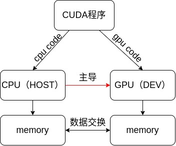
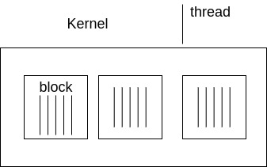
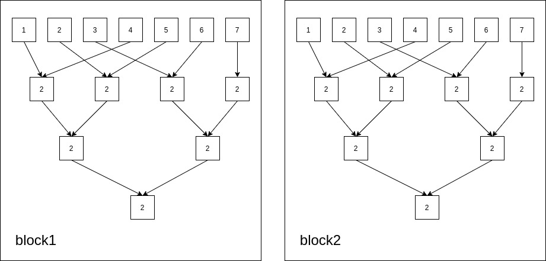
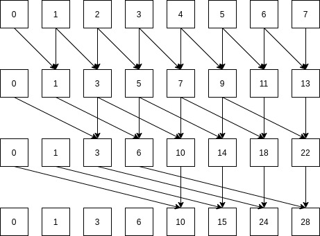

# CUDA的学习笔记

## 基础知识

### CUDA软件体系

1. CUDA Library
2. Runtim API
3. Drive API

### 通讯模式 Communication Patterns

1. 映射 map:一一对应（one to one） 例如：```y[i] = 3 * x[i]```

2. 聚合 gather:多对一（many to one）例如：```y[i] = (x[i-1]+x[i]+x[i+1])/3```

3. 分散 scatter：少对多（one to many）与gather相反

4. 模板 stencil 以固定模式读取相邻的内存数值（serveral-to-one）

5. 转置 transpose

6. 压缩 reduce

7. 重排 scan/sort

### CUDA编程模型



1. CPU分配空间给GPU```cudaMalloc()```

2. CPU复制数据给GPU```cudaMemcpy()```

3. CPU加载Kernels函数给GPU计算
4. CPU复制GPU数据

### CUDA编程特点

1. **最大特点**：线程块将在何时何处运行不作保证
**原则**： 同一个block的线程会在同一时间运行在同一个SM中，同一个内核的所有线程块全部完成之后才会运行下一个内核。
2. **内存速度**：**local memory > share memory >> global memory > host memory**
3. **同步操作**：
   1. 线程同步```__syncthreads()```，屏障```__barrier_sync()```，当所有线程到达屏障时才继续进行

   2. ```__threadfence()```通知整个grid当前thread的进度

   3. 在HOST端可以使用```cudaThreadSynchronize()```, 同步host端和device端

### GPU硬件特点



**SM**即流处理器：把Kernel分配的线程块放到SM中运行

### 高效策略

**计算强度  =  $\frac{Math}{Memory(每个线程的内存)}$**

常用的方式

1. Kernel读取的数据量最小
2. 让每个线程读取的速度更快
   1. 使用local memory > share memory > global memory
   2. 合并全局内存（线程按顺序读取内存）

3. 避免线程发散
   1. 不要在不同线程执行不同的代码块
   2. 循环长度不同

4. 查看本机参数，kernel加载时不要超过本机参数

### 各种内存的使用方式

1.局部内存，local memory, 在kernel函数中创建的局部变量（每个线程都有自己的局部变量内存空间）
2.全局内存, global memory, GPU kernel函数接收CPU数据的内存空间，所有的线程块使用同一个全局内存
3.共享内存， shared memory, 一个线程块里的所有线程同用一个共享内存

### 原子操作

可以使多线程读写同一内存队列

1. 目前只支持简单的整形运算```atomicAdd()```

2. 读取顺序不确定
3. 肯能会拖慢系统时间

## 程序设计

### 归约reduction

暂时理解为并行求和算法，以下图为例子



由图可知其**算法步骤**大致可以分为：

1. 将输入的待加的数据对半分开取整，然后按照设计步长依次相加，没有对应相加的数据直接落下来，在第二次运算时相加，直到只有最后一个数据，便是这个线程块数据的总和

2. 然后在把所有线程块里最后的一个数据重复步骤1的操作，即可得到所有数据的总和

```c++
//步骤1代码 （使用以共享内存计算为例子）
__global__ void shared_reduce(float * d_out, float * d_in){       
   //每一个线程快共享一个 shared memory
    extern __shared__ float sdata[];
    int threadid = threadIdx.x;
    int kernelid = threadIdx.x + blockDim.x * blockIdx.x;

    sdata[threadid] = d_in[kernelid];

    __syncthreads();

    for(unsigned int s = blockDim.x / 2; s > 0 ; s >>= 1 ){
        if(threadid < s){
            sdata[threadid] += sdata[threadid + s];
        }
        __syncthreads();
    }
    if(threadid == 0){
        d_out[blockIdx.x] = sdata[threadid];
    }
}
```

### 扫描scan

&emsp;&emsp;暂时理解为，把内存中的数据作累加，例如计算一家餐厅的一周以来的**前某天**的收入总和。以下图为例子。

&emsp;&emsp;&emsp;&emsp;&emsp;&emsp;

1. 先让里面所有数据间隔为$2^0$的数据两两相加
2. 再让里面数据间隔为$2^1$的数据两两相加，一直执行n次，截至条件为$2^n \geq s$,s为数据总量

```c++
__global__ void global_scan(float * d_out, float * d_in, int size){
    int kernelid = threadIdx.x + blockDim.x * blockIdx.x;
    // int threadid = threadIdx.x;
    int local_size = size;      //减少对全局变量的读取次数
    float out = 0.00f;
    d_out[kernelid] = d_in[kernelid];
    __syncthreads();
    for(int interval  = 1; interval < local_size; interval <<= 1 ){
        if(kernelid - interval >= 0){
            out = d_out[kernelid] + d_out[kernelid - interval];
        }
        __syncthreads();
        if(kernelid >= interval){
            d_out[kernelid] = out;
            out = 0.00f;
        }
    }
}
```

**目前该[程序](./cuda_code_practice/scan/scan.cu)存在问题**：当输入的d_in的size太大时会出现计算错误

### 并行直方图

以128个数字做直方图为例子，采用**局部直方图**的方法进行设计

1. 先把128分成若干组，每一组调一个线程，在其内部建立一个串行直方图，以8组为例，所以一共需要建立8个线程，每个线程处理16个数据的串行直方图
2. 然后使用归约算法（reduction）将这个8个线程内的数据加起来，即可得到并行设计的直方图

