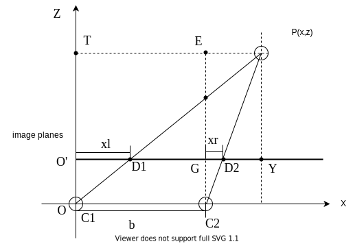

# 双目视觉学习笔记

## 理论部分

### 双目相机模型

$$ \left\{
\begin{aligned}
\triangle TOP \backsim \triangle OO'D_1 \\
\triangle C_2EP \backsim \triangle C_2GD_2  \\
\end{aligned}
\right.
\Rightarrow \left\{
\begin{aligned}
\frac{x}{xl} & = \frac{z}{OO'(f)} \\
\frac{x-b}{xr} & = \frac{z}{OO'(f)}  \\
\end{aligned}
\right.
\Rightarrow \left\{
\begin{aligned}
& xl = \frac{x}{z}    \\
& xr = \frac{x-b}{z}f \\
\end{aligned}
\right.
\Rightarrow z = \frac{b}{xl-xr}f
$$

### 相机坐标系——像面坐标系

$$
\begin{aligned}
\triangle PO_cA \backsim \triangle P'O_cB \Rightarrow \frac{Z_c}{y} &= \frac{PO_c}{P'O_c}=\frac{AO_c}{BO_c} \\
\triangle PO_cC \backsim \triangle P'O_cE \Rightarrow \frac{X_c}{x} &= \frac{PO_c}{P'O_c}=\frac{CO_c}{EO_c} \\
\triangle DO_cC \backsim \triangle EO_2O_c \Rightarrow \frac{Y_c}{y} &= \frac{CO_c}{EO_c}=\frac{PO_c}{P'O_c}=\frac{Z_c}{f} \\
\end{aligned}
$$

$$
\left\{
\begin{aligned}
x & = \frac{X_c}{Z_c}f  \\
x & = \frac{Y_c}{Z_c}f  \\
\end{aligned}
\right.
\Rightarrow Z_c
\begin{bmatrix} x \\ y \\ 1
\end{bmatrix}
= \begin{bmatrix} f & 0 & 0 & 0\\
0&f&0&0\\ 0&0&1&0 \end{bmatrix}
\begin{bmatrix} X_c\\Y_c\\ Z_c \\1 \end{bmatrix}
$$

$$
\left\{
\begin{aligned}
\begin{bmatrix} u \\ v \\1 \end{bmatrix} & = \begin{bmatrix} \frac{1}{\mathrm{d}x} & 0 & u_0 \\ 0 &
\frac{1}{\mathrm{d}y} & v_0 \\ 0 & 0 & 1 \end{bmatrix} \begin{bmatrix} x \\ y \\ 1 \end{bmatrix} \\
 Z_c \begin{bmatrix} x \\ y \\ 1 \end{bmatrix} & = \begin{bmatrix} f & 0 & 0 & 0\\
0&f&0&0\\ 0&0&1&0 \end{bmatrix}
\begin{bmatrix} X_c\\Y_c\\ Z_c \\1 \end{bmatrix}  \\
\end{aligned}
\right.
\Rightarrow\begin{bmatrix} u \\ v \\ 1 \end{bmatrix} =\frac{1}{Z_c}
\begin{bmatrix}\frac{1}{\mathrm{d}x} & 0 & u_0 \\ 0 &
\frac{1}{\mathrm{d}y} & v_0 \\ 0 & 0 & 1
 \end{bmatrix}\begin{bmatrix} f & 0 & 0 & 0\\
0&f&0&0\\ 0&0&1&0 \end{bmatrix}
\begin{bmatrix} X_c\\Y_c\\ Z_c \\1 \end{bmatrix}
$$

### 世界坐标系——相机坐标系

#### 刚体变换：旋转

$$
\begin{aligned}
    & 在\triangle AOF中 \left\{\begin{aligned}
        OA=y\cdot \sin \theta  \\
        AF =x\cdot\cos\theta  \\
        \end{aligned}
        \right. \\
    & 在\triangle FEP中 \left\{\begin{aligned}
        & EP=AB = y\cdot \cos \theta  \\
        & FE=x\cdot\sin\theta  \\
        \end{aligned}
        \right.\\
\end{aligned}
\Rightarrow
\left \{ \begin{aligned}
    x^* & = x\cdot\cos\theta + y\cdot\sin\theta  \\
    y^* & = y\cdot\cos\theta - x\cdot\sin\theta  \\
    z^* & = z                                    \\
    \end{aligned}
\right.
\Rightarrow \quad\begin{bmatrix}x^*\\y^*\\z^*\end{bmatrix}
=\begin{bmatrix}\cos\theta&\sin\theta&0\\
-\sin\theta&\cos\theta&0\\0&0&1\end{bmatrix}
\begin{bmatrix}x\\y\\z\end{bmatrix}
$$
依此类推其他旋转轴:
$$
\left\{
\begin{aligned}
\begin{bmatrix}x^*\\y^*\\z^*\end{bmatrix}
& =\begin{bmatrix}1&0&0\\
0&\cos\alpha&\sin\alpha\\
0&-\sin\alpha&\cos\alpha\end{bmatrix}
& \begin{bmatrix}x\\y\\z\end{bmatrix}
\Rightarrow
\begin{bmatrix}x^*\\y^*\\z^*\end{bmatrix}& =R_1
\begin{bmatrix}x\\y\\z\end{bmatrix} \qquad(x) \\
\begin{bmatrix}x^*\\y^*\\z^*\end{bmatrix}
& =\begin{bmatrix}\cos\alpha&0&\sin\alpha\\
0&1&0\\
-\sin\alpha&0&\cos\alpha
\end{bmatrix}
& \begin{bmatrix}x\\y\\z\end{bmatrix}
\Rightarrow
\begin{bmatrix}x^*\\y^*\\z^*\end{bmatrix} & =R_2
\begin{bmatrix}x\\y\\z\end{bmatrix} \qquad (y) \\
\begin{bmatrix}x^*\\y^*\\z^*\end{bmatrix}
& =\begin{bmatrix}\cos\theta&\sin\theta&0\\
-\sin\theta&\cos\theta&0\\0&0&1\end{bmatrix}
& \begin{bmatrix}x\\y\\z\end{bmatrix}
\Rightarrow
\begin{bmatrix}x^*\\y^*\\z^*\end{bmatrix} & =R_3
\begin{bmatrix}x\\y\\z\end{bmatrix} \qquad (z)
\end{aligned}
\right.
$$

#### 刚体变换：平移

$$
\left \{ \begin{aligned}
x^* = x+a \\
y^* = y+b \\
z^* = z+c \\
\end{aligned}
\right.
\Rightarrow
\begin{bmatrix}
x^*\\y^*\\z^*\\1\end{bmatrix}
=\begin{bmatrix}1&0&0&a\\
0&1&0&b\\
0&0&1&c\\
0&0&0&1\end{bmatrix}
\begin{bmatrix}x\\y\\z\\1\end{bmatrix}
$$

#### 刚体变换整合

$$
\left \{ \begin{aligned}
\begin{bmatrix}x^*\\y^*\\z^*\end{bmatrix}
& =R_1R_2R_3
\begin{bmatrix}x\\y\\z\end{bmatrix} &（旋转）\\
\begin{bmatrix}
x^*\\y^*\\z^*\\1\end{bmatrix}
& =\begin{bmatrix}1&0&0&a\\
0&1&0&b\\
0&0&1&c\\
0&0&0&1\end{bmatrix}
\begin{bmatrix}x\\y\\z\\1\end{bmatrix}&（平移）\\
\end{aligned}
\right.
$$
与相机坐标转换公式联立：
$$
\left \{ \begin{aligned}
\begin{bmatrix}
x^*\\y^*\\z^*\\1\end{bmatrix}
& =\begin{bmatrix}R&T\\
0&1
\end{bmatrix}
\begin{bmatrix}x\\y\\z\\1\end{bmatrix}  \\
\begin{bmatrix} u \\ v \\ 1 \end{bmatrix} & =\frac{1}{Z_c}
\begin{bmatrix}\frac{1}{\mathrm{d}x} & 0 & u_0 \\ 0 &
\frac{1}{\mathrm{d}y} & v_0 \\ 0 & 0 & 1 
 \end{bmatrix}\begin{bmatrix} f & 0 & 0 & 0\\
0&f&0&0\\ 0&0&1&0 \end{bmatrix}
\begin{bmatrix} X_c\\Y_c\\ Z_c \\1 \end{bmatrix}\\
\end{aligned}
\right.
$$

$$\Rightarrow\begin{bmatrix} u \\ v \\ 1 \end{bmatrix} =\frac{1}{Z_c}
\begin{bmatrix}f_x & 0 & u_0 &0\\ 0 &
f_y& v_0&0 \\ 0 & 0 & 1 &0
 \end{bmatrix}
\begin{bmatrix} R &T\\
 \overrightarrow{0} & 1 
 \end{bmatrix}
\begin{bmatrix} X_c\\Y_c\\ Z_c \\1 \end{bmatrix}
$$

$$\Rightarrow\begin{bmatrix} u \\ v \\ 1 \end{bmatrix} =\frac{1}{Z_c}
\begin{bmatrix}\frac{f}{\mathrm{d}x} & 0 & u_0 &0\\ 0 &
\frac{f}{\mathrm{d}y} & v_0&0 \\ 0 & 0 & 1 &0
 \end{bmatrix}
\begin{bmatrix} R &T\\
  \overrightarrow{0}& 1 
 \end{bmatrix}
\begin{bmatrix} X_c\\Y_c\\ Z_c \\1 \end{bmatrix}$$