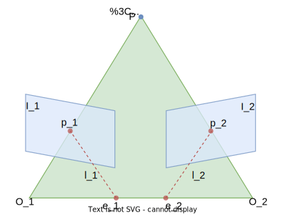
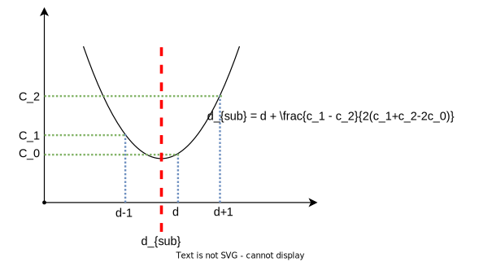
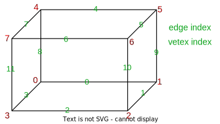
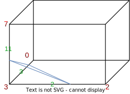

# 双目视觉与三维重建

[toc]

## 双目视觉理论部分

### 坐标系变化

#### 影像坐标系

影像坐标系是一个二维坐标系，是用来描述图片中的像素的位置的坐标系。可以分为两种坐标系：

* 以像素为单位的$(u,v)$坐标系
* 以物理尺寸为单位的$(x,y)$坐标系


在计算机视觉中，$(u,v)$坐标系以左上角位置为原点，$u$轴和$v$轴分别平行于图像平面的两条垂直边（$u$轴朝右，$v$轴朝下）。
$(x,y)$坐标系以像主点为原点，$x$轴和$y$轴分别与$u$轴和$v$轴平行且方向一致。

**像主点**:是摄影中心到成像平面的垂点。

如果我们知道像素到物理尺寸的转换关系，即一个像素的物理尺寸，也就是像元尺寸为$dx*dy$($x$方向的尺寸$dx$,$y$方向尺寸为$dy$)，就可以在两类坐标系之间相互转换：
$$
\left\{
\begin{aligned} \tag1
u - u_0 = \frac{x}{d_x} \\
v - v_0 = \frac{y}{d_y}  \\
\end{aligned}
\right.
$$

为了方便矩阵运算，可以写成矩阵形式：

$$
\begin{equation} \tag2
    \begin{bmatrix}
        u \\ v \\ 1
    \end{bmatrix}
    =
    \begin{bmatrix}
        \frac{1}{d_x} & 0 & u_0 \\
        0 & \frac{1}{d_y} & v_0 \\
        0 & 0 & 1
    \end{bmatrix}
    \begin{bmatrix} x \\ y \\ z
    \end{bmatrix}
\end{equation}
$$

#### 相机坐标系

相机坐标系是一个三维空间坐标系，是非常关键的一个坐标系，它承担着建立影像坐标系和世界坐标系之间联系的重任。所以前人们在建立相机坐标系时，有一个很关键的考量是如何能更好的把影像坐标系和世界坐标系之间联系起来。

两个三维坐标系（相机和世界）之间的转换用旋转和平移就可以方便表达，重点是三维的相机坐标系和二维的影像坐标系之间如何更好转换。


首先我们要从上图观察其几何关系：
$$
\left\{
\begin{aligned} \tag3
\triangle PO_cA \backsim \triangle P'O_cB \Rightarrow \frac{Z_c}{y} &= \frac{PO_c}{P'O_c}=\frac{AO_c}{BO_c} \\
\triangle PO_cC \backsim \triangle P'O_cE \Rightarrow \frac{X_c}{x} &= \frac{PO_c}{P'O_c}=\frac{CO_c}{EO_c} \\
\triangle DO_cC \backsim \triangle EO_2O_c \Rightarrow \frac{Y_c}{y} &= \frac{CO_c}{EO_c}=\frac{PO_c}{P'O_c}=\frac{Z_c}{f} \\
\end{aligned}
\right.
$$
可以的到：
$$
\left\{
\begin{aligned}\tag4
x & = \frac{X_c}{Z_c}f  \\
x & = \frac{Y_c}{Z_c}f  \\
\end{aligned}
\right.
$$

我们可以将其写成矩阵形式
$$
\begin{equation} \tag5
Z_c
\begin{bmatrix} x \\ y \\ 1
\end{bmatrix}
= \begin{bmatrix} f & 0 & 0 & 0\\
0&f&0&0\\ 0&0&1&0 \end{bmatrix}
\begin{bmatrix} X_c\\Y_c\\ Z_c \\1 \end{bmatrix}
\end{equation}
$$
将式$(5)$和式$(2)$联立最终可得：
$$
\begin{equation}\tag6
\begin{bmatrix} u \\ v \\ 1 \end{bmatrix} =\frac{1}{Z_c}
\begin{bmatrix}\frac{f}{\mathrm{d}x} & 0 & u_0 \\ 0 &
\frac{f}{\mathrm{d}y} & v_0 \\ 0 & 0 & 1
 \end{bmatrix}
\begin{bmatrix} X_c\\Y_c\\ Z_c  \end{bmatrix}
\end{equation}
$$

通常情况下把$Z_c$称为尺度因子$\lambda$,把中间$3\times3$的矩阵叫做**内参矩阵**用K来表示,所以可以得到相机坐标系到影像$(u,v)$坐标系的表达式可以写成：
$$
\begin{equation}\tag7
    \lambda p = KP_c
\end{equation}
$$

#### 内参矩阵

记$f_x = \frac{f}{\mathrm{d}y}$和$f_y = \frac{f}{\mathrm{d}y}$，而且由于制造工艺的偏差，像素不是绝对的矩形，而是一个平行四边形，于是在K矩阵中引入一个倾斜因子$s = f_x \tan(a)$,此时可以表示K矩阵为：

$$
\begin{equation} \tag8
    K=
    \begin{bmatrix}
    f_x & s & u_0 \\
    0 & f_y & v_0 \\
    0 & 0 & 1 \\
    \end{bmatrix}
\end{equation}
$$

#### 刚体变换

##### 旋转

下面分析一下刚体变化的公式：

如下图所示：


$$
\begin{aligned}
    & 在\triangle AOF中 \left\{\begin{aligned}
        OA=y\cdot \sin \theta  \\
        AF =x\cdot\cos\theta  \\
        \end{aligned}
        \right. \\
    & 在\triangle FEP中 \left\{\begin{aligned}
        & EP=AB = y\cdot \cos \theta  \\
        & FE=x\cdot\sin\theta  \\
        \end{aligned}
        \right.\\
\end{aligned}
\Rightarrow
\left \{ \begin{aligned}
    x^* & = x\cdot\cos\theta + y\cdot\sin\theta  \\
    y^* & = y\cdot\cos\theta - x\cdot\sin\theta  \\
    z^* & = z                                    \\
    \end{aligned}
\right.
\Rightarrow \quad\begin{bmatrix}x^*\\y^*\\z^*\end{bmatrix}
=\begin{bmatrix}\cos\theta&\sin\theta&0\\
-\sin\theta&\cos\theta&0\\0&0&1\end{bmatrix}
\begin{bmatrix}x\\y\\z\end{bmatrix}
$$
依此类推其他旋转轴:
$$
\left\{
\begin{aligned}
\begin{bmatrix}x^*\\y^*\\z^*\end{bmatrix}
& =\begin{bmatrix}1&0&0\\
0&\cos\alpha&\sin\alpha\\
0&-\sin\alpha&\cos\alpha\end{bmatrix}
& \begin{bmatrix}x\\y\\z\end{bmatrix}
\Rightarrow
\begin{bmatrix}x^*\\y^*\\z^*\end{bmatrix}& =R_1
\begin{bmatrix}x\\y\\z\end{bmatrix} \qquad(x) \\
\begin{bmatrix}x^*\\y^*\\z^*\end{bmatrix}
& =\begin{bmatrix}\cos\alpha&0&\sin\alpha\\
0&1&0\\
-\sin\alpha&0&\cos\alpha
\end{bmatrix}
& \begin{bmatrix}x\\y\\z\end{bmatrix}
\Rightarrow
\begin{bmatrix}x^*\\y^*\\z^*\end{bmatrix} & =R_2
\begin{bmatrix}x\\y\\z\end{bmatrix} \qquad (y) \\
\begin{bmatrix}x^*\\y^*\\z^*\end{bmatrix}
& =\begin{bmatrix}\cos\theta&\sin\theta&0\\
-\sin\theta&\cos\theta&0\\0&0&1\end{bmatrix}
& \begin{bmatrix}x\\y\\z\end{bmatrix}
\Rightarrow
\begin{bmatrix}x^*\\y^*\\z^*\end{bmatrix} & =R_3
\begin{bmatrix}x\\y\\z\end{bmatrix} \qquad (z)
\end{aligned}
\right.
$$

##### 平移

平移量的计算比较容易理解，这边直接列公式可得：
$$
\left \{ \begin{aligned}
x^*= x+a \\
y^* = y+b \\
z^*= z+c \\
\end{aligned}
\right.
\Rightarrow
\begin{bmatrix}
x^*\\y^*\\z^*\\1\end{bmatrix}
=\begin{bmatrix}1&0&0&a\\
0&1&0&b\\
0&0&1&c\\
0&0&0&1\end{bmatrix}
\begin{bmatrix}x\\y\\z\\1\end{bmatrix}
$$

##### 刚体变换整合

$$
\begin{equation}\tag9
\left \{ \begin{aligned}
\begin{bmatrix}x^*\\y^*\\z^*\end{bmatrix}
 &=R_{3\times3}
\begin{bmatrix}x\\y\\z\end{bmatrix} + t_{3\times1}
\\
\begin{bmatrix}
x^*\\y^*\\z^*
\end{bmatrix} &= \begin{bmatrix} R_{3\times3} &
t_{3\times1}
\end{bmatrix} \begin{bmatrix}x\\y\\z\\1\end{bmatrix}
\end{aligned}
\right.
\end{equation}
$$

#### 世界坐标系

世界坐标系是一个固定的三维坐标系，是一个绝对坐标系，它旨在将空间中的所有点都统一到同一个坐标系下表达，在不同的应用场景中，世界坐标系的定义并不一样，比如大地测量中，将水准原点当做世界坐标系的原点；在相机标定中，将标定板的某个角点作为世界坐标系。
**世界坐标系和相机坐标系都是三维坐标系，它们之间可以用旋转平移来做转换**。

可以用上述式$(9)$表示：
$$
\begin{equation}\tag{10 }
\left \{ \begin{aligned}
\begin{bmatrix}X_c\\Y_c\\Z_c\end{bmatrix}
 &=R_{3\times3}
\begin{bmatrix}X_w\\Y_w\\Z_w\end{bmatrix} + t_{3\times1}
\\
\begin{bmatrix}
X_c\\Y_c\\Z_c
\end{bmatrix} &= \begin{bmatrix} R_{3\times3} &
t_{3\times1}
\end{bmatrix} \begin{bmatrix}X_w\\Y_w\\Z_w\\1\end{bmatrix}
\end{aligned}
\right.
\end{equation}
$$

#### 外参矩阵

**外参矩阵也是相机的关键参数之一**，由一个3x3的单位正交旋转矩阵$R$和3x1的平移矢量$t$组成，它们描述的是世界坐标系到相机坐标系之间的转换关系。需要提一点的是，在不同学科中外参矩阵会有一些定义区别，比如在摄影测量学科中，将相机坐标系转换到世界坐标系的旋转矩阵$R$以及摄影中心在世界坐标系中的位置$C$作为外参。它们目的一致，都是为了描述相机和世界坐标系之间的转换关系。

同样用一个简单表达式来描述世界坐标系到相机坐标系的变换：

$$
\begin{equation}\tag{11}
P_c = \begin{bmatrix}R & T
\end{bmatrix}\begin{bmatrix}P_w \\ 1
\end{bmatrix}
\end{equation}
$$

#### 投影矩阵

在实践过程中，最直接接触的是影像$(u,v)$坐标系和世界坐标系，在影像三维重建中，通常前者是输入，后者是输出，所以将世界坐标系转换成$(u,v)$坐标系是很关键的转换。

联立上述公式可得：
$$
\begin{equation}\tag{11}
\lambda \begin{bmatrix}u & v & 1
\end{bmatrix} = \begin{bmatrix}
    f_x & s & u_0 \\
    0 & f_y & v_0 \\
    0 & 0 & 1 \\
\end{bmatrix}\begin{bmatrix} R_{3\times3} &
t_{3\times1}\end{bmatrix}\begin{bmatrix}X_w\\Y_w\\Z_w\\1\end{bmatrix}
\end{equation}
$$

世界坐标系到影像坐标系的转换实际上表达的是透视投影中空间点到像点的投影关系，所以把该转换矩阵叫做投影矩阵$M$，通过矩阵运算可知投影矩阵是一个3x4的矩阵，它是内参矩阵和外参矩阵的乘积。

同样用一个简单表达式来表达这种转换：
$$
\begin{equation}\tag{12}
\lambda p = K \begin{bmatrix}R & T
\end{bmatrix}  \begin{bmatrix}P_w \\ 1
\end{bmatrix}
=M\begin{bmatrix}P_w \\ 1 \end{bmatrix}
\end{equation}
$$

### 双目相机模型

双目视觉的模型如下图所示：


分析其几何关系可得：

$$ \left\{
\begin{aligned}
\triangle TOP \backsim \triangle OO'D_1 \\
\triangle C_2EP \backsim \triangle C_2GD_2  \\
\end{aligned}
\right.
\Rightarrow \left\{
\begin{aligned}
\frac{x}{xl} & = \frac{z}{OO'(f)} \\
\frac{x-b}{xr} & = \frac{z}{OO'(f)}  \\
\end{aligned}
\right.
\Rightarrow \left\{
\begin{aligned}
& xl = \frac{x}{z}    \\
& xr = \frac{x-b}{z}f \\
\end{aligned}
\right.
\Rightarrow z = \frac{b}{xl-xr}f
$$

### 关键矩阵

#### 极平面和极线



 | 符号 | 含义 |
 | :---: | :---:|
 | $O$ | 光心 |
 | $I$ | 像面 |
 | $p$ | 像平面上的对应点 |
 | $P$ | 三维空间中的点 |
 | $l$ | 极线 |

#### 本质矩阵和基础矩阵

设空间点P在左相机坐标系坐标的坐标为$P$，则在右相机坐标系中的坐标为$RP+t$，其在左右相机视图中的投影点分别为$p_1,p_2$。基于相机坐标系到影像坐标系的转换公式，得到如下转换式：
$$
\begin{align}\tag{1}
    d_1 p_1 &= K_1 P \\ \tag{2}
    d_2 p_2 &= K_2(RP + t)
\end{align}
$$

左边的$p$是齐次坐标，如果对空间点也取齐次，即将空间点归一化到$Z=1$的平面，$d = \frac{1}{Z_c}$就变成了1，上式变成:
$$
\begin{align}\tag{3}
    p_1 &= K_1 P \\ \tag{4}
    p_2 &= K_2(RP + t)
\end{align}
$$
该等式在齐次意义上成立，也就是乘以任意非零常数依旧相等。把$K$取到公式左侧：
$$
\begin{align}\tag{5}
    K_1^{-1}p_1 &=  P \\ \tag{6}
    K_2^{-1}p_2 &= (RP + t)
\end{align}
$$
设：
$$
\left \{
\begin{align}   \nonumber
    x_1 &= P \\ \nonumber
    x_2 &= RP+t
\end{align}
\right.
\Rightarrow
x_2 = Rx_1+t \tag{7}
$$
同时叉乘$t$，可得：
$$
\begin{align} \nonumber
t\times x_2&=t \times Rx_1 + t \times t \\ \tag{8}
\Rightarrow t \times Rx_1 &= t \times x_2
\end{align}
$$

同时左乘$x_2^{T}$，可得：
$$
\begin{align} \nonumber
x_2^{T}t \times Rx_1 &= x_2^{T}t \times x_2 \\ \tag{9}
\Rightarrow x_2^{T}t \times Rx_1 &= 0
\end{align}
$$

叉乘可以等价于用反对称矩阵来点乘，$t$的反对称矩阵表示为$t^{\wedge}$，上式变成:
$$
x_2^{T}t^{\wedge}Rx_1 = 0  \tag{10}
$$

该式描述了像平面坐标$x_1,x_2$之间的联系，即空间点在两个像平面的成像点通过外参矩阵$R,t$建立了一个等式关系，或者称为一种约束关系，这个约束就叫做对极约束。

把像平面坐标$x_1,x_2$还原为之前的$p_1,p_2$,可以的到：
$$
p_2^{T}K_2^{-T}t^{\wedge}RK_1^{-1}p_1 = 0 \tag{11}
$$

这两个公式是等价的，它们都是对极约束，几何意义是$O_1,P,O_2,p_1,p_2$共面。把上面两式像点中间夹着的部分记做两个矩阵：本质矩阵E：Essential matrix和基础矩阵F：Fundamental matrix。得到更简洁的表示形式：
$$
\begin{align} \tag{12}
x_2^{T}Ex_1 &= 0 \\ \tag{13}
p_2^{T}Fp_1 &= 0
\end{align}
$$
其中，本质矩阵和基础矩阵的表达式分别是：
$$
\begin{align} \tag{14}
E &=  t^{\wedge}R\\ \tag{15}
F &= K_2^{-T}t^{\wedge}RK_1^{-1}
\end{align}
$$
本质矩阵和基础矩阵的区别是：本质矩阵是和$x$建立的关系，而$x$是由内参矩阵$K$和像素坐标$p$计算出来的，所以本质矩阵使用的前提是内参矩阵$K$已知；而基础矩阵直接和像素坐标$p$建立联系，所以不需要已知内参矩阵。

#### 单应性矩阵

**当空间中场景是同一个平面时，它们在左右视图的投影点可通过可逆的单应性矩阵一对一相互转换**，表达式为：
$$
\begin{align} \tag{16}
p_2 &= Hp_1
\end{align}
$$

实际上，单应性矩阵不只是描述同一平面的像素点之间的关系，而是**同一个平面在任意坐标系之间都可以建立单应性变换关系，比如影像坐标系与影像坐标系之间，世界坐标系和影像坐标系之间**。
从单应性矩阵的角度，我们来完成基础矩阵的另一个推导，假设左右视图中的一对同名点$p_1,p_2$它们之间的单应性变换矩阵为$H$，则有:
$$
p_2 = Hp_1 \tag{17}
$$

设右视图上的极点为$e_2$,则$e_2$和$p_2$共同构成极线$l$,则有：
$$
l = c_2 \times p_2 = c_2^{\wedge}Hp_1 \tag{18}
$$
由于$p_2$在极线上，则有$p_2^{t}l = 0$ 推得：
$$
F = e_2^{\wedge}H
$$

即基础矩阵等于右视图极点的反对称矩阵和像素之间单应性矩阵的乘积。

## 三维重建基础

### 八叉树

## 立体匹配算法

### SGM匹配算法

#### SGM程序框图



#### 代价计算

在对已经进行过极限校正的左右视差图来说：

* 代价计算即是在给定的估计的视差范围内找到令代价函数值最低的视差值。
* 目前给定的视差范围就是在左右图像的同一行之中(**误差较大需要修改**)

##### Census变换法与Hamming距离

&emsp;&emsp;Census变换是使用像素邻域内的局部灰度差异将像素灰度转换为由0，1组成的比特串，思路非常简单，通过将邻域窗口(窗口大小为$n \times m$,n和m都为奇数)内的像素灰度值与窗口中心像素的灰度值进行比较，将比较得到的布尔值映射到一个比特串中。
&emsp;&emsp;基于Census变换的匹配代价计算方法是计算左右影像对应的两个像素的Census变换值的汉明（Hamming）距离。Hamming距离即两个比特串的对应位不相同的数量，计算方法为将两个比特串进行亦或运算，再统计亦或运算结果的比特位中不为1的个数。

#### 代价聚合

代价聚合的主要目的引入局部或者全局信息，即相当于一种滤波，相当于一种平滑。

像素$P$沿着某条路径$r$的路径代价计算公式:
$$
L_r(p,d) = C(p,d)+min \left \{ \begin{aligned}
    & L_r(p-r,d) \\
    & L_r(p-r,d-1) + P_1 \\
    & L_r(p-r,d+1) + P_1 \\
    & \substack{\min \\ i}L_r(p-r,i) + P_2 \\
\end{aligned}
\right \}-\substack{\min \\ i}L_r(p-r,i)
$$

&emsp;&emsp;公式中$p$代表像素，$r$代表路径，左右路径的情形下$p-r$就是$p$左侧（从左到右聚合）或者右侧（从右到左聚合）的相邻像素，他们行号相等，列号相差1。$L$是聚合代价值，$C$是初始代价值。$P_1,P_2$是惩罚系数。$P_2$的计算方式如下所示：
$$
P_2 = P_{2_{int}}/(I_p- I_{p-r})
$$
$I$表示像素的灰度，$P_{2_{int}}$是$P_2$的最大值，和$P_1$同为输入参数。

#### 视差优化

优化目的：

1. **提高精度**
2. **剔除错误**
3. **弱纹理优化**
4. **填补空洞**

优化手段：

1. **子像素拟合（Subpixel）**
2. **一致性检查（Left/Right Consistency Check）**
3. **唯一性约束（Uniqueness）**
4. **剔除小连通区（Remove Peaks）**
5. **中值滤波（Median Filter）**

##### 子像素拟合

把最优的视差值的前一个视差和后一个视察进行二次拟合，曲线的极值点横坐标就是视差值的子像素位置，把其对应的值设定为最佳视差。如图所示：


##### 一致性检查

**含义**：

1. 对调前，左影像像素$a$匹配右影像像素$b$；则对调后，$b$也匹配$a$为一致，否则为不一致(比如对调后$b$匹配$b$)。
2. 对调前，左影像像素$a$的视差为$d$；则对调后右影像像素$a-d$的视差为$d$为一致，否则为不一致。

**一般步骤**：

1. 获取左右视差图。
2. 对左视差图的每个像素$a$，计算出同名点在右视差图中的像素位置$b$。
3. 判断$a$和$b$的视差值之差的绝对值是否小于一个阈值(通常为1个像素)。
4. 如果超过阈值，则一致性检查不通过，把对应位置的视差变为无效值。

**两种策略**：

1. **内部型检查**：
    内部型就是直接通过左影像的代价数组，来推算右影像的代价数组，从而计算右影像的视差图。所以你只用代价聚合一次就可以做一致性检查。即：
    对于右影像的像素$(i,j)$，根据视差值$d$可算出左影像的对应像素位置为$(i,j+d)$，然后把左影像$(i,j+d)$同样视差值$d$下的代价值取出来赋给$(i,j,d)$。
2. **外部型检查**：
   就是在算法输入时把左右图像数据对调，再执行一次完整的立体匹配，得到右影像视差图，一致性检查则是采用同样的策略。这里需要注意的是，左右对调后，视差在意义上和左影像是相反的，而立体匹配算法的设定是：视差=左减右，如果只做对调（就是简单的把右影像数据作为左影像数据传进算法），是得不到正确结果的，因为对调后重叠区在两边，不符合算法的设定，一般会在对调后，把左右影像的像素来个水平镜像翻转，这样两张影像的重叠区到了中间，视差就等于左减右了。

##### 唯一性约束

**唯一性约束的含义是**：最优视差的代价值应该是所有候选视差中唯一的最小代价，换句话说它的代价值比其他视差的代价值足够小，这样它才能在众多候选视差中脱颖而出。如果有另外一个视差的代价值和它一样，那么它就不再是最好的那一个了，而是最好的两个之一，不满足唯一性约束，便舍弃这个点。

其实，这里面蕴含的另一层含义是：视差估计的可靠性！如果两个最小的代价值相差很小，比如一个是30，一个是31，因为视差估计是带有噪声影响的，所以其实不能肯定的说是30最好还是31最好，可能31才是正确的那个视差，因为两个值相差太小了，可能是由于一些轻微的噪声导致实际上最优的那个视差的代价值却是次最小的。

用程序来处理时，我们会计算最小代价和次最小代价的相对差值，如果差值小于阈值，那就表明最小的两个代价值相差不明显，就给这个像素赋一个无效视差。

##### 剔除小连通区

**含义**：通过4-邻域或8-邻域连通在一起的像素集合，在SGM中，这一步用来剔除连通在一起的小块错误匹配像素。过区域跟踪，把它们跟踪成块，然后判断块的大小是否小于一定的阈值，如果是则剔除，即把整块都置为无效视差。

##### 中值滤波

**含义**：中值滤波在立体匹配中使用的还挺广泛的，作为一个平滑算法，它主要是用来剔除视差图中的一些孤立的离群外点，同时还能起到填补小洞的作用。

## 曲面重建算法

[pcl库写法链接](https://blog.csdn.net/qq_18820125/article/details/107442268?utm_medium=distribute.pc_relevant.none-task-blog-2~default~baidujs_baidulandingword~default-4.topblog&spm=1001.2101.3001.4242.3&utm_relevant_index=7)

<https://blog.csdn.net/shenziheng1/article/details/71194149>

### Marching Cubes

如何理解Marching Cubes算法的含义：

直观来讲就是：将点云数据所处的空间，用许多的小立方体填充满，让小立方体所处的空间完全的包裹住所有的点云数据。

此时在点云数据的边界处，会存在如下情况：

处于边界的小立方体，并不是所有的点都在想要的点云数据的包裹之中，需要找一种方法来描述这些点，我们便在小立方体中按照如下设定用于描述，如下所示：


当有的顶点的位置处于想要的点云数据之外,如下图点3所示，这是这个小立方体被切割的形状只有下图一种形式：



由此可得：每个小正方体有8个顶点，每个顶点都有两种状态(在点云数据内，在点云数据外)，所以一共有256种情况，每一种情况都对应了一种对小正方体的切割方式，于是可以使用查找表的方式，把所有的切割情况提前计算存储进内存，只通过判断定点状态便可以获得每个小正方体的切割状态。

如何判断那些点是我们需要的点云数据，通过**等值面**。

等值面是空间中的一个曲面，我们规定空间中每一个点都有一个属性值，属性值相等连续空间组成的曲面，我们称之为等值面。

切面与小正方体边的交点$P$可以通过线性插值进行计算：

$$
P = P_1 + (isovalue - V_1)(P_2 - P_1)(V_2 - V_1)
$$

```c++
mu = (isolevel - valp1) / (valp2 - valp1);
p.x = p1.x + mu * (p2.x - p1.x);
p.y = p1.y + mu * (p2.y - p1.y);
p.z = p1.z + mu * (p2.z - p1.z);
```

### Smooth Methods

#### 隐式方法

* 输入：无序点云$P$ + 法向量$V$
* 思想：计算定义在三维空间中的隐式函数来表示物体表面的三角网格
* 优点：计算快，内存消耗低
* 缺点：
  * 鲁棒性差，尤其对外点空洞，不均匀点云分布
  * 依赖法向量
  * 无法还原sharp features

##### Poisson surface reconstruction

##### Screened Poisson surface reconstruction

#### 显式方法

* 输入：无序点云$P$，**不**需要法向量$V$
* 思想：将曲面重建问题定义作用为在Delaunay Triangulation上的二分类问题，直接还原出物体表面。

* 优点:
  * 鲁棒性强，多用于基于MVS生成的稠密点云的曲面重建
  * 不依赖法向量
* 缺点：无法还原sharp features

##### Efficient Multi-View Reconstruction of Large-Scale Scenes

##### Robust and Efficient surface reconstruction

### Primitive-based Methods

* 输入：无序点云$P$，**不**需要法向量$V$
* 思想：
  * 对于某些人造的物体，家具，机械零件等，表面可以用高阶几何元素来表示。例如：平面，圆柱体，椎体。

  * 从低维度的无序原始数据中提取高阶几何元素来表示物体来表示物体表面
  
  * 将提取出的离散的几何元素拼接成Polygonal Mesh

#### Connectivity-based Methods

**方法原文**：Architectural Modeling from Sparsely Scanned Range Date.

* 优点:
  * 算法复杂度低
  * 可以还原sharp features
* 缺点：鲁棒性差，尤其对于噪声比较严重的点云数据，intersection关系还原较差
  
#### Slicing-based Medthods

**方法原文**：Robust piecewise-planar 3D reconstruction and completion from large-scale unstructured point data.
**PolyFit**: Polyonal Surface Reconstruction from Point clouds.
**Connect-Slice**: an hybrid approach for reconstruction 3D objects.

* 优点:
  * 鲁棒性强，应用场景比较丰富
  * 保证输出mesh为2d manifold和intersection-free
  * 可以还原sharp features
* 缺点：
  * 计算复杂度很高，内存消耗大
  * 搜索空间大，优化速度慢
