# 双目视觉学习笔记

## 理论部分

### 坐标系变化

#### 影像坐标系

影像坐标系是一个二维坐标系，是用来描述图片中的像素的位置的坐标系。可以分为两种坐标系：

* 以像素为单位的$(u,v)$坐标系
* 以物理尺寸为单位的$(x,y)$坐标系

在计算机视觉中，$(u,v)$坐标系以左上角位置为原点，$u$轴和$v$轴分别平行于图像平面的两条垂直边（$u$轴朝右，$v$轴朝下）。
$(x,y)$坐标系以像主点为原点，$x$轴和$y$轴分别与$u$轴和$v$轴平行且方向一致。

**像主点**:是摄影中心到成像平面的垂点。

如果我们知道像素到物理尺寸的转换关系，即一个像素的物理尺寸，也就是像元尺寸为$dx*dy$($x$方向的尺寸$dx$,$y$方向尺寸为$dy$)，就可以在两类坐标系之间相互转换：
$$
\left\{
\begin{aligned} \tag1
u - u_0 = \frac{x}{d_x} \\
v - v_0 = \frac{y}{d_y}  \\
\end{aligned}
\right.
$$

为了方便矩阵运算，可以写成矩阵形式：

$$
\begin{equation} \tag2
    \begin{bmatrix}
        u \\ v \\ 1
    \end{bmatrix}
    =
    \begin{bmatrix}
        \frac{1}{d_x} & 0 & u_0 \\
        0 & \frac{1}{d_y} & v_0 \\
        0 & 0 & 1
    \end{bmatrix}
    \begin{bmatrix} x \\ y \\ z
    \end{bmatrix}
\end{equation}
$$

#### 相机坐标系

相机坐标系是一个三维空间坐标系，是非常关键的一个坐标系，它承担着建立影像坐标系和世界坐标系之间联系的重任。所以前人们在建立相机坐标系时，有一个很关键的考量是如何能更好的把影像坐标系和世界坐标系之间联系起来。

两个三维坐标系（相机和世界）之间的转换用旋转和平移就可以方便表达，重点是三维的相机坐标系和二维的影像坐标系之间如何更好转换。

首先我们要从上图观察其几何关系：
$$
\left\{
\begin{aligned} \tag3
\triangle PO_cA \backsim \triangle P'O_cB \Rightarrow \frac{Z_c}{y} &= \frac{PO_c}{P'O_c}=\frac{AO_c}{BO_c} \\
\triangle PO_cC \backsim \triangle P'O_cE \Rightarrow \frac{X_c}{x} &= \frac{PO_c}{P'O_c}=\frac{CO_c}{EO_c} \\
\triangle DO_cC \backsim \triangle EO_2O_c \Rightarrow \frac{Y_c}{y} &= \frac{CO_c}{EO_c}=\frac{PO_c}{P'O_c}=\frac{Z_c}{f} \\
\end{aligned}
\right.
$$
可以的到：
$$
\left\{
\begin{aligned}\tag4
x & = \frac{X_c}{Z_c}f  \\
x & = \frac{Y_c}{Z_c}f  \\
\end{aligned}
\right.
$$

我们可以将其写成矩阵形式
$$
\begin{equation} \tag5
Z_c
\begin{bmatrix} x \\ y \\ 1
\end{bmatrix}
= \begin{bmatrix} f & 0 & 0 & 0\\
0&f&0&0\\ 0&0&1&0 \end{bmatrix}
\begin{bmatrix} X_c\\Y_c\\ Z_c \\1 \end{bmatrix}
\end{equation}
$$
将式$(5)$和式$(2)$联立最终可得：
$$
\begin{equation}\tag6
\begin{bmatrix} u \\ v \\ 1 \end{bmatrix} =\frac{1}{Z_c}
\begin{bmatrix}\frac{f}{\mathrm{d}x} & 0 & u_0 \\ 0 &
\frac{f}{\mathrm{d}y} & v_0 \\ 0 & 0 & 1
 \end{bmatrix}
\begin{bmatrix} X_c\\Y_c\\ Z_c  \end{bmatrix}
\end{equation}
$$

通常情况下把$Z_c$称为尺度因子$\lambda$,把中间$3\times3$的矩阵叫做**内参矩阵**用K来表示,所以可以得到相机坐标系到影像$(u,v)$坐标系的表达式可以写成：
$$
\begin{equation}\tag7
    \lambda p = KP_c
\end{equation}
$$

#### 内参矩阵

记$f_x = \frac{f}{\mathrm{d}y}$和$f_y = \frac{f}{\mathrm{d}y}$，而且由于制造工艺的偏差，像素不是绝对的矩形，而是一个平行四边形，于是在K矩阵中引入一个倾斜因子$s = f_x \tan(a)$,此时可以表示K矩阵为：

$$
\begin{equation} \tag8
    K=
    \begin{bmatrix}
    f_x & s & u_0 \\
    0 & f_y & v_0 \\
    0 & 0 & 1 \\
    \end{bmatrix}
\end{equation}
$$

### 刚体变换

#### 旋转

下面分析一下刚体变化的公式：

如下图所示：

$$
\begin{aligned}
    & 在\triangle AOF中 \left\{\begin{aligned}
        OA=y\cdot \sin \theta  \\
        AF =x\cdot\cos\theta  \\
        \end{aligned}
        \right. \\
    & 在\triangle FEP中 \left\{\begin{aligned}
        & EP=AB = y\cdot \cos \theta  \\
        & FE=x\cdot\sin\theta  \\
        \end{aligned}
        \right.\\
\end{aligned}
\Rightarrow
\left \{ \begin{aligned}
    x^* & = x\cdot\cos\theta + y\cdot\sin\theta  \\
    y^* & = y\cdot\cos\theta - x\cdot\sin\theta  \\
    z^* & = z                                    \\
    \end{aligned}
\right.
\Rightarrow \quad\begin{bmatrix}x^*\\y^*\\z^*\end{bmatrix}
=\begin{bmatrix}\cos\theta&\sin\theta&0\\
-\sin\theta&\cos\theta&0\\0&0&1\end{bmatrix}
\begin{bmatrix}x\\y\\z\end{bmatrix}
$$
依此类推其他旋转轴:
$$
\left\{
\begin{aligned}
\begin{bmatrix}x^*\\y^*\\z^*\end{bmatrix}
& =\begin{bmatrix}1&0&0\\
0&\cos\alpha&\sin\alpha\\
0&-\sin\alpha&\cos\alpha\end{bmatrix}
& \begin{bmatrix}x\\y\\z\end{bmatrix}
\Rightarrow
\begin{bmatrix}x^*\\y^*\\z^*\end{bmatrix}& =R_1
\begin{bmatrix}x\\y\\z\end{bmatrix} \qquad(x) \\
\begin{bmatrix}x^*\\y^*\\z^*\end{bmatrix}
& =\begin{bmatrix}\cos\alpha&0&\sin\alpha\\
0&1&0\\
-\sin\alpha&0&\cos\alpha
\end{bmatrix}
& \begin{bmatrix}x\\y\\z\end{bmatrix}
\Rightarrow
\begin{bmatrix}x^*\\y^*\\z^*\end{bmatrix} & =R_2
\begin{bmatrix}x\\y\\z\end{bmatrix} \qquad (y) \\
\begin{bmatrix}x^*\\y^*\\z^*\end{bmatrix}
& =\begin{bmatrix}\cos\theta&\sin\theta&0\\
-\sin\theta&\cos\theta&0\\0&0&1\end{bmatrix}
& \begin{bmatrix}x\\y\\z\end{bmatrix}
\Rightarrow
\begin{bmatrix}x^*\\y^*\\z^*\end{bmatrix} & =R_3
\begin{bmatrix}x\\y\\z\end{bmatrix} \qquad (z)
\end{aligned}
\right.
$$

#### 平移

平移量的计算比较容易理解，这边直接列公式可得：
$$
\left \{ \begin{aligned}
x^*= x+a \\
y^* = y+b \\
z^*= z+c \\
\end{aligned}
\right.
\Rightarrow
\begin{bmatrix}
x^*\\y^*\\z^*\\1\end{bmatrix}
=\begin{bmatrix}1&0&0&a\\
0&1&0&b\\
0&0&1&c\\
0&0&0&1\end{bmatrix}
\begin{bmatrix}x\\y\\z\\1\end{bmatrix}
$$

#### 刚体变换整合

$$
\begin{equation}\tag9
\left \{ \begin{aligned}
\begin{bmatrix}x^*\\y^*\\z^*\end{bmatrix} 
 &=R_{3\times3}
\begin{bmatrix}x\\y\\z\end{bmatrix} + t_{3\times1}
\\
\begin{bmatrix}
x^*\\y^*\\z^*
\end{bmatrix} &= \begin{bmatrix} R_{3\times3} & 
t_{3\times1}
\end{bmatrix} \begin{bmatrix}x\\y\\z\\1\end{bmatrix}
\end{aligned}
\right.
\end{equation}
$$

### 世界坐标系

世界坐标系是一个固定的三维坐标系，是一个绝对坐标系，它旨在将空间中的所有点都统一到同一个坐标系下表达，在不同的应用场景中，世界坐标系的定义并不一样，比如大地测量中，将水准原点当做世界坐标系的原点；在相机标定中，将标定板的某个角点作为世界坐标系。
**世界坐标系和相机坐标系都是三维坐标系，它们之间可以用旋转平移来做转换**。

可以用上述式$(9)$表示：
$$
\begin{equation}\tag{10 }
\left \{ \begin{aligned}
\begin{bmatrix}X_c\\Y_c\\Z_c\end{bmatrix} 
 &=R_{3\times3}
\begin{bmatrix}X_w\\Y_w\\Z_w\end{bmatrix} + t_{3\times1}
\\
\begin{bmatrix}
X_c\\Y_c\\Z_c
\end{bmatrix} &= \begin{bmatrix} R_{3\times3} & 
t_{3\times1}
\end{bmatrix} \begin{bmatrix}X_w\\Y_w\\Z_w\\1\end{bmatrix}
\end{aligned}
\right.
\end{equation}
$$

### 外参矩阵

**外参矩阵也是相机的关键参数之一**，由一个3x3的单位正交旋转矩阵$R$和3x1的平移矢量$t$组成，它们描述的是世界坐标系到相机坐标系之间的转换关系。需要提一点的是，在不同学科中外参矩阵会有一些定义区别，比如在摄影测量学科中，将相机坐标系转换到世界坐标系的旋转矩阵$R$以及摄影中心在世界坐标系中的位置$C$作为外参。它们目的一致，都是为了描述相机和世界坐标系之间的转换关系。

同样用一个简单表达式来描述世界坐标系到相机坐标系的变换：

$$
\begin{equation}\tag{11}
P_c = \begin{bmatrix}R & T
\end{bmatrix}\begin{bmatrix}P_w \\ 1
\end{bmatrix}
\end{equation}
$$

### 投影矩阵

在实践过程中，最直接接触的是影像$(u,v)$坐标系和世界坐标系，在影像三维重建中，通常前者是输入，后者是输出，所以将世界坐标系转换成$(u,v)$坐标系是很关键的转换。

联立上述公式可得：
$$
\begin{equation}\tag{11}
\lambda \begin{bmatrix}u & v & 1
\end{bmatrix} = \begin{bmatrix}
    f_x & s & u_0 \\
    0 & f_y & v_0 \\
    0 & 0 & 1 \\
\end{bmatrix}\begin{bmatrix} R_{3\times3} & 
t_{3\times1}\end{bmatrix}\begin{bmatrix}X_w\\Y_w\\Z_w\\1\end{bmatrix}
\end{equation}
$$

世界坐标系到影像坐标系的转换实际上表达的是透视投影中空间点到像点的投影关系，所以把该转换矩阵叫做投影矩阵$M$，通过矩阵运算可知投影矩阵是一个3x4的矩阵，它是内参矩阵和外参矩阵的乘积。

同样用一个简单表达式来表达这种转换：
$$
\begin{equation}\tag{12}
\lambda p = K \begin{bmatrix}R & T
\end{bmatrix}  \begin{bmatrix}P_w \\ 1 
\end{bmatrix}
=M\begin{bmatrix}P_w \\ 1 \end{bmatrix}
\end{equation}
$$

### 双目相机模型

双目视觉的模型如下图所示：

分析其几何关系可得：

$$ \left\{
\begin{aligned}
\triangle TOP \backsim \triangle OO'D_1 \\
\triangle C_2EP \backsim \triangle C_2GD_2  \\
\end{aligned}
\right.
\Rightarrow \left\{
\begin{aligned}
\frac{x}{xl} & = \frac{z}{OO'(f)} \\
\frac{x-b}{xr} & = \frac{z}{OO'(f)}  \\
\end{aligned}
\right.
\Rightarrow \left\{
\begin{aligned}
& xl = \frac{x}{z}    \\
& xr = \frac{x-b}{z}f \\
\end{aligned}
\right.
\Rightarrow z = \frac{b}{xl-xr}f
$$

## 代码实践

### SGM匹配

#### SGM程序框图

#### 代价计算

代价计算即是在给定的估计的视差范围内找到令代价函数值最低的视差值。

##### Census变换法

&emsp;&emsp;Census变换是使用像素邻域内的局部灰度差异将像素灰度转换为由0，1组成的比特串，思路非常简单，通过将邻域窗口(窗口大小为$n \times m$,n和m都为奇数)内的像素灰度值与窗口中心像素的灰度值进行比较，将比较得到的布尔值映射到一个比特串中。
&emsp;&emsp;基于Census变换的匹配代价计算方法是计算左右影像对应的两个像素的Census变换值的汉明（Hamming）距离。Hamming距离即两个比特串的对应位不相同的数量，计算方法为将两个比特串进行亦或运算，再统计亦或运算结果的比特位中不为1的个数。

#### 代价聚合

像素$P$沿着某条路径$r$的路径代价计算公式:
$$
L_r(p,d) = C(p,d)+min \left \{ \begin{aligned}
    & L_r(p-r,d) \\
    & L_r(p-r,d-1) + P_1 \\
    & L_r(p-r,d+1) + P_1 \\
    & \substack{\min \\ i}L_r(p-r,i) + P_2 \\
\end{aligned}
\right \}-\substack{\min \\ i}L_r(p-r,i)
$$

&emsp;&emsp;公式中$p$代表像素，$r$代表路径，左右路径的情形下$p-r$就是$p$左侧（从左到右聚合）或者右侧（从右到左聚合）的相邻像素，他们行号相等，列号相差1。$L$是聚合代价值，$C$是初始代价值。
